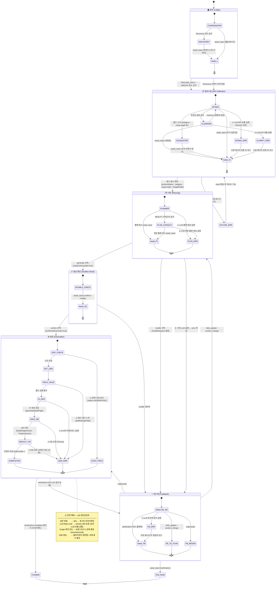

# Triple C - AI 마케팅 콘텐츠 에이전트

> **상품 상세페이지 제작 시간을 1시간 → 10분으로 단축하는 AI 기반 마케팅 콘텐츠 자동화 플랫폼**

[](https://nextjs.org/)
[](https://www.typescriptlang.org/)
[](https://tailwindcss.com/)
[](https://www.postgresql.org/)
[](https://www.docker.com/)

---

## 프로젝트 소개

**Triple C (Contents · Copy · Creative)** 는 AI를 활용하여 마케팅 콘텐츠를 자동 생성하는 B2B/B2C 플랫폼입니다.

### 해결하고자 한 문제
- 상품 상세페이지 제작에 **평균 1시간 이상** 소요
- 디자이너/카피라이터 리소스 부족
- 브랜드 톤앤매너 일관성 유지 어려움

### 솔루션
| 기존 방식 | Triple C |
|----------|----------|
| 수동 디자인/카피 작성 | AI 자동 생성 (2개 버전) |
| 브랜드 가이드 수동 참조 | RAG 기반 브랜드 분석 자동 적용 |
| 단일 포맷 출력 | HTML, 이미지, GIF, MP4 다중 포맷 |

---

## 주요 기능

### 1. AI 상세페이지 자동 생성
- 상품 이미지/텍스트 입력 → **2개 버전 자동 생성**
- 섹션별 카피/이미지 AI 생성 (HERO, FEATURES, HOW_TO_USE 등)
- 프롬프트 기반 이미지 재생성 및 편집

### 2. RAG 기반 브랜드 분석
- 웹사이트 URL, 문서 업로드 → 자동 크롤링 및 청킹
- OpenAI Embeddings + 벡터 검색으로 브랜드 톤앤매너 추출
- 생성 시 브랜드 일관성 자동 적용

### 3. 에디터 & 내보내기
- 드래그 앤 드롭 블록 에디터
- 배경 제거, 이미지 리사이징
- HTML, PNG, GIF, MP4 다중 포맷 내보내기

### 4. 마켓플레이스
- 템플릿 판매/구매 시스템
- CLIP 기반 유사 이미지 검색
- 크레딧 기반 결제 시스템

---

## 기술 스택

### Frontend
- **Framework**: Next.js 15 (App Router)
- **Language**: TypeScript
- **Styling**: Tailwind CSS, shadcn/ui
- **State**: React Hook Form, Zustand

### Backend
- **API**: Next.js API Routes
- **Database**: PostgreSQL (Neon) + Prisma ORM
- **Auth**: NextAuth.js (JWT)
- **Storage**: Cloudinary (이미지), R2 (파일)

### AI & ML
- **Text Generation**: Google Gemini, OpenAI GPT-4, Anthropic Claude
- **Image Generation**: Google Gemini Image API
- **Embeddings**: OpenAI text-embedding-3-small
- **Image Search**: CLIP (Xenova/transformers.js)

### Infrastructure
- **Deployment**: Vercel (Frontend + API)
- **Database**: Neon Postgres (Serverless)
- **Container**: Docker Compose (개발 환경)
- **CI/CD**: GitHub Actions

---

## 시스템 아키텍처

```
┌─────────────────────────────────────────────────────────────────┐
│                        Client (Browser)                          │
│    Login │ Dashboard │ Editor │ Marketplace                      │
└─────────────────────────────────────────────────────────────────┘
                              │ HTTPS
                              ▼
┌─────────────────────────────────────────────────────────────────┐
│                    Vercel Edge Network                           │
└─────────────────────────────────────────────────────────────────┘
                              │
                              ▼
┌─────────────────────────────────────────────────────────────────┐
│                 Next.js Application (Vercel)                     │
│  ┌─────────────────────────────────────────────────────────┐    │
│  │  App Router (Frontend) + API Routes (Backend)            │    │
│  └─────────────────────────────────────────────────────────┘    │
│  ┌─────────────────────────────────────────────────────────┐    │
│  │  Services: AI │ Image │ RAG │ Payment                    │    │
│  └─────────────────────────────────────────────────────────┘    │
└─────────────────────────────────────────────────────────────────┘
         │              │              │              │
         ▼              ▼              ▼              ▼
   ┌──────────┐  ┌──────────┐  ┌──────────┐  ┌──────────┐
   │  Neon    │  │Cloudinary│  │  Gemini  │  │  OpenAI  │
   │ Postgres │  │  (CDN)   │  │ (AI Gen) │  │(Embed)   │
   └──────────┘  └──────────┘  └──────────┘  └──────────┘
```

> 상세 아키텍처: [SYSTEM_ARCHITECTURE.md](./SYSTEM_ARCHITECTURE.md)

---

## 프로젝트 구조

```
src/
├── app/                    # Next.js App Router
│   ├── (auth)/            # 인증 페이지
│   ├── (dashboard)/       # 대시보드
│   ├── api/               # API Routes
│   └── editor/            # 에디터 페이지
├── components/            # React 컴포넌트
│   ├── ui/               # shadcn/ui 기반 UI
│   ├── editor/           # 에디터 컴포넌트
│   └── dashboard/        # 대시보드 컴포넌트
├── services/             # 비즈니스 로직
│   ├── ai/              # AI 서비스 (Gemini, OpenAI)
│   ├── image/           # 이미지 처리
│   └── rag/             # RAG 파이프라인
├── lib/                  # 유틸리티
└── types/               # TypeScript 타입
```

---

## 실행 방법

### 1. 환경 설정

```bash
# 저장소 클론
git clone https://github.com/jiwonkimkim/triple-c-ai-agent.git
cd triple-c-ai-agent

# 의존성 설치
npm install

# 환경 변수 설정
cp .env.example .env.local
```

### 2. 개발 서버 실행

```bash
# 개발 서버
npm run dev

# Docker 환경 (PostgreSQL 포함)
docker-compose up -d
```

### 3. 빌드 & 테스트

```bash
# 프로덕션 빌드
npm run build

# 린트
npm run lint

# 테스트
npm test
```

---

## 기술적 도전과 해결

### 1. AI 이미지 생성 품질 최적화
**문제**: Gemini 이미지 생성 시 텍스트 오버레이가 깨지는 현상
**해결**: 2-Step 파이프라인 구현 (이미지 생성 → 별도 오버레이 렌더링)

### 2. 브랜드 일관성 유지
**문제**: 다양한 브랜드의 톤앤매너를 자동으로 파악하기 어려움
**해결**: RAG 파이프라인 구축 (웹크롤링 → 청킹 → 임베딩 → 벡터 검색)

### 3. 실시간 에디터 성능
**문제**: 대용량 이미지 편집 시 렌더링 지연
**해결**: Canvas 기반 레이어 시스템 + 이미지 lazy loading

---

## 🔍 System State Transition Diagram (QA Analysis)

채팅 에이전트 시스템의 상태 전이를 LangGraph 소스코드 기반으로 분석한 다이어그램입니다.
QA 관점에서 **정상 경로(Happy Path)** 와 **예외 경로(Error Path)** 를 함께 표현합니다.



### 단계별 예외 (QA 체크포인트)

| 단계 | 예외 | 코드 위치 | 실제 동작 |
|------|------|-----------|-----------|
| 정보수집 | LLM API 실패 (INTAKE/CLARIFIER) | `intake.ts` LLM 호출 블록 | 오류 메시지 → `await_input` |
| 정보수집 | `/api/upload` 실패 | `chat-input.tsx` → `route.ts` | toast 알림 후 재시도 가능 |
| 기획 | LLM 플랜 생성 실패 | `planner.ts` LLM 호출 블록 | `nextAction: error` → Feedback 위임 |
| 생성 | 중복 요청 (`status=GENERATING`) | `generator.ts:18` | 기존 프로젝트 반환, 신규 생성 차단 |
| 생성 | 필수 필드 누락 | `generator.ts:88` + `types.ts:484` | `GEN_ERR` → `nextAction: error` → Feedback |
| 생성 | AI API 타임아웃/실패 | `generator.ts:243` | `GEN_ERR` → Feedback으로 라우팅 |
| 생성 | DB 오류 | `generator.ts:129, 273, 334` | `GEN_ERR` → Feedback으로 라우팅 |
| 피드백 | LLM 피드백 분석 실패 | `feedback.ts` LLM 호출 블록 | 오류 메시지 → `await_input` |

### 전역 예외 (모든 단계 공통)

| 예외 | 발생 위치 | 트리거 조건 |
|------|-----------|-------------|
| 세션 만료 | `messages/route.ts` 상단 auth 체크 | NextAuth 세션 없음 → 401 |
| LLM Rate Limit | 모든 에이전트 LLM 호출 | Gemini 429 응답 |
| Graph 재귀 초과 | `graph.ts:325` `recursionLimit: 50` | 에이전트 루프 50회 |
| SSE 연결 끊김 | `route.ts` ReadableStream | 클라이언트 네트워크 단절 |

### ⚠ 주의해야 할 QA 취약 구간

1. **생성 확인 이중 구조** — `readyToGenerate=true` 후 COORDINATOR가 한 번 더 확인 메시지를 보내야 `confirmedGenerate=true`가 됨. 확인 없이 바로 생성 진입하는 경로 테스트 필요
2. **이미지 스킵 키워드 의존** — `route.ts`에서 `'스킵/건너뛰/없어...'` 키워드 매칭으로 스킵 처리. 다른 표현 사용 시 `waitingForImageUpload` 상태에 갇힘
3. **SUGGESTER 순차 루프** — 필드 완성 후 SUGGESTER가 다음 빈 필드로 계속 이동. 특정 필드 스킵 불가 시 무한 대기
4. **Graph 재귀 50회 한도** — COORDINATOR ↔ 에이전트 루프 + Feedback ↔ 재생성 반복 시 도달 가능

---

## 🧠 Design Decisions (설계 의사결정 및 QA 인사이트)

프로젝트의 안정성과 확장성을 위해 도입한 핵심 기술들에 대한 엔지니어링 기록입니다.

### 1. 왜 LangGraph인가? (Multi-Agent 워크플로우 제어)
* **도입 이유**: 단순한 Sequential 체인으로는 복잡한 AI 에이전트의 '피드백 루프(유저 재질문 -> 기획 수정)'를 제어하기 어려웠습니다.
* **QA 관점의 이점**:
    * **상태 가시성**: 각 노드(Node)별로 상태(State)를 명확히 정의할 수 있어, 결함 발생 시 어느 단계에서 데이터가 오염되었는지 추적이 용이합니다.
    * **제어권**: `recursionLimit` 설정을 통해 무한 루프를 방지하는 등 시스템의 Fail-safe를 설계 단계에서 확보할 수 있었습니다.

### 2. Hybrid Retrieval & RRF (검색 신뢰도 향상)
* **도입 이유**: 유저의 모호한 질문(키워드 중심)과 구체적인 질문(의도 중심) 모두에 대응하기 위해 벡터 검색(Semantic)과 키워드 검색(BM25)을 결합했습니다.
* **QA적 성과**:
    * **RRF(Reciprocal Rank Fusion)**를 적용하여 두 검색 결과의 순위를 재조정함으로써, 단순 검색 대비 관련성 높은 정보를 상단에 배치하는 비율을 높였습니다.
    * 이를 통해 AI가 잘못된 정보(Hallucination)를 기반으로 기획안을 작성하는 결함을 줄일 수 있었습니다.

---

## 🌐 크로스 브라우저 호환성 테스트 결과

`npx playwright test --project=chromium --project=firefox --project=webkit` 실행 기준

### 테스트 항목

| TC-ID | 검증 내용 |
|-------|----------|
| TC-01 | 채팅 목록 페이지 — 빈 상태 핵심 UI (제목·서브타이틀·새 대화 버튼·CTA) |
| TC-02 | 채팅 목록 페이지 — 대화 항목 렌더링 (제목·상태 배지·메시지 미리보기·메시지 수) |
| TC-03 | 채팅 대화 페이지 — 헤더 및 입력창 (뒤로가기 버튼·h1·textarea·placeholder) |
| TC-04 | SSE 스트리밍 — AI 메시지 렌더링 및 전송 후 textarea 재활성화 |
| TC-05 | API 오류 — 에러 배너 텍스트·textarea 재활성화·URL 유지 |

### 브라우저별 실행 결과

| 브라우저 | TC-01 | TC-02 | TC-03 | TC-04 | TC-05 | 합계 |
|---------|-------|-------|-------|-------|-------|------|
| **Chrome** (chromium) | — | — | — | — | — | DB + `.env.local` 필요 |
| **Firefox** | ✅ PASS | ✅ PASS | ✅ PASS | ✅ PASS | ✅ PASS | **5 / 5** |
| **WebKit** (Safari) | ✅ PASS | ✅ PASS | ✅ PASS | ✅ PASS | ✅ PASS | **5 / 5** |

> Chrome은 `DATABASE_URL` + `NEXTAUTH_SECRET`이 담긴 `.env.local`이 있으면 동일하게 실행됩니다.

### 발견된 문제와 해결

| 문제 | 원인 | 해결 |
|------|------|------|
| 프로젝트 이름 불일치 | Playwright config에 `compat-chrome` 등 비표준 이름 사용 | `chromium / firefox / webkit`으로 표준화 |
| webServer 120초 타임아웃 | `NEXTAUTH_SECRET` 누락 → `/` 루트가 500 에러로 리디렉트 | `.env.local` 자동 로드 후 `webServer.env`에 주입, 헬스체크 URL을 `/login`으로 변경 |
| Firefox / WebKit 바이너리 없음 | 초기 설치 미완료 | `npx playwright install firefox webkit` |
| DB 없이 auth setup 불가 | `auth.setup.ts`가 실제 DB 로그인 요구 | `compat-auth.setup.ts` 추가 — `next-auth/jwt encode()`로 JWT 직접 생성, DB 없이 인증 쿠키 발급 |
| Strict mode 위반 — heading | `'대화'`가 h1(`대화`)과 h3(`아직 대화가 없습니다`) 두 개에 매칭 | 로케이터에 `{ exact: true }` 추가 |
| Strict mode 위반 — button | `header button.first()`이 `lg:hidden` 모바일 버튼을 잡음 | 뒤로가기 버튼에 `data-testid="back-button"` 추가 |
| 로그인 버튼 중복 감지 | `'로그인'` 버튼이 일반 로그인 + `🔧 개인 개발자 로그인` 두 개 매칭 | `{ exact: true }` 추가로 정확히 지정 |

---

## 🧾 API Integrity Test (Postman)

백엔드 로직의 안정성을 검증하기 위해 API 시나리오 테스트를 수행했습니다.

- **공유 자료**: [Postman Collection 파일 바로가기](./tests/api/triple-c-api.postman_collection.json)
- **검증 항목**:
  - 유효한 세션에서의 채팅 메시지 전송 (200 OK)
  - 인증 정보 누락 시 에러 처리 (401 Unauthorized)
  - 필수 필드(`productName` 등) 누락 시 유효성 검사 (400 Bad Request)

### 컬렉션 구성

| 폴더 | 요청 수 | 대표 엔드포인트 |
|------|--------|---------------|
| 🔐 Auth | 4 | `POST /api/auth/signup` (B2C / B2B) |
| 💬 Chat | 7 | `POST /api/chat/{id}/messages` (SSE 스트리밍) |
| 🏷️ Brands | 12 | CRUD + URL 크롤링 / RAG 검색 / 청크 관리 |
| 📁 Projects | 13 | CRUD + 버전 관리 / 임시저장 / HTML 내보내기 |
| 🤖 Generate | 1 | `POST /api/generate/detail-page` |
| 🖼️ Upload | 1 | `POST /api/upload` (multipart/form-data, Cloudflare R2) |
| 🛍️ Marketplace | 6 | 템플릿 목록 / 시맨틱 검색 / 구매 |
| 📋 Templates | 6 | CRUD + 마켓플레이스 게시 |
| 🧪 A/B Tests | 7 | CRUD + 이벤트 기록 (공개 엔드포인트) |
| 💰 Billing | 6 | Stripe 구독 / 결제 / 크레딧 / 포털 |
| 🏪 Seller | 5 | 잔액 / 거래 내역 / 출금 신청 |
| ⚙️ Settings | 19 | 프로필 / 비밀번호 / 2FA / 세션 / 워크스페이스 |
| 📊 Analytics | 2 | 대시보드 통계 / 사용량 분석 |
| 🛠️ Admin | 2 | 템플릿 임베딩 배치 |
| **합계** | **91** | **14개 폴더, 11개 경로 변수** |

### Import 방법

```
1. Postman 실행 → [Import] 클릭
2. tests/api/triple-c-api.postman_collection.json 파일 선택
3. Environments에서 base_url = http://localhost:3000 확인
4. 로그인 후 발급된 next-auth.session-token 쿠키가 자동으로 인증에 사용됩니다
```

---

## 🔬 버그 회고 분석 (Retrospective QA)

`fix:` 커밋 20개를 QA 엔지니어 관점에서 역분석하여, 각 버그를 **코딩 전에 잡을 수 있었던 테스트 케이스**를 정리했습니다.

- [회고 분석 문서](./docs/RETROSPECTIVE_TEST_ANALYSIS.md) — 20개 사례별 Playwright 아이디어 + 테스트 설계 기법 (BVA, 동등 분할, 에러 추정)
- [재발 방지 테스트 코드](./tests/e2e/bug-prevention.spec.ts) — Case #1 · Case #14 실행 가능한 Playwright 구현체

---

## ⚡ 성능 테스트 (Load Test)

nGrinder를 활용해 핵심 API인 `POST /api/generate/detail-page`의 부하 특성을 분석하고, **임계 지점과 인프라 개선 방향**을 도출했습니다.

### 테스트 환경

| 항목 | 내용 |
|------|------|
| 도구 | nGrinder 3.5.9 (Docker Compose, Controller + Agent) |
| 스크립트 | Groovy — 4-step 시나리오 (CSRF → 로그인 → 프로젝트 생성 → 상세페이지 생성) |
| SLA 기준 | 응답시간 < 10,000ms (CLAUDE.md Performance targets 기준) |

### 부하 테스트 결과

> 테스트 수행 후 실측값으로 채워주세요. 템플릿 양식: [성능 테스트 결과 보고서](./docs/PERFORMANCE_TEST_REPORT.md)

| Vuser | TPS | Peak TPS | MTT (ms) | 에러율 | SLA |
|------:|----:|---------:|---------:|-------:|:---:|
| 1  |  |  |  |  |  |
| 5  |  |  |  |  |  |
| 10 |  |  |  |  |  |
| 20 |  |  |  |  |  |

### 발견된 임계 지점

| 병목 구간 | 원인 | 응답시간 비중 |
|-----------|------|:------------:|
| AI 호출 (`generateDetailPage`) | OpenAI / Gemini 외부 API 레이턴시 | **~90%** |
| 직렬 DB 쿼리 × 5회 | `await` 순차 실행, 병렬화 미적용 | ~5% |
| 크레딧 차감 Race Condition | Read-then-write 패턴, 원자적 처리 없음 | — |

### 개선 제안 (우선순위 순)

| 개선 항목 | 방법 | 기대 효과 |
|-----------|------|-----------|
| DB 쿼리 병렬화 | `Promise.all()` 적용 | MTT 20~30% 단축 |
| 크레딧 원자적 차감 | `updateMany` + 조건절 | 동시 요청 시 데이터 정합성 보장 |
| 비동기 큐 전환 | BullMQ + Redis Worker | 동시 처리량 수평 확장 가능 |
| 응답 캐싱 | Redis TTL 캐시 (입력값 해시 키) | 중복 요청 비용·시간 99% 절감 |

> 상세 분석 및 Before/After 코드: [성능 테스트 결과 보고서](./docs/PERFORMANCE_TEST_REPORT.md)
> nGrinder 실행 방법: [nGrinder 설치 및 스크립트 등록 가이드](./docs/NGRINDER_LOAD_TEST_GUIDE.md)
> 테스트 스크립트: [`tests/performance/generate-detail-page.groovy`](./tests/performance/generate-detail-page.groovy)

---

## 팀 구성

| 이름 | 역할 | 담당 기능 |
|------|------|----------|
| 김지원 | Full-Stack | AI 이미지 생성, 에디터, 마켓플레이스, 프롬프트 엔지니어링 |
| 팀원2 | Backend | RAG 파이프라인, 브랜드 분석, CLIP 검색 |
| 팀원3 | Frontend | 대시보드, UI/UX |

---

## 문서

- [시스템 아키텍처](./SYSTEM_ARCHITECTURE.md)
- [아키텍처 다이어그램](./ARCHITECTURE_DIAGRAM.md)
- [배포 가이드](./DEPLOYMENT.md)
- [Docker 설정](./DOCKER_SETUP.md)
- [PRD](./Plan_prd_trd/PRD_TripleC_EN.md)
- [TRD](./Plan_prd_trd/TRD_TripleC_EN.md)

---

## 라이선스

이 프로젝트는 팀 프로젝트로 진행되었습니다.
